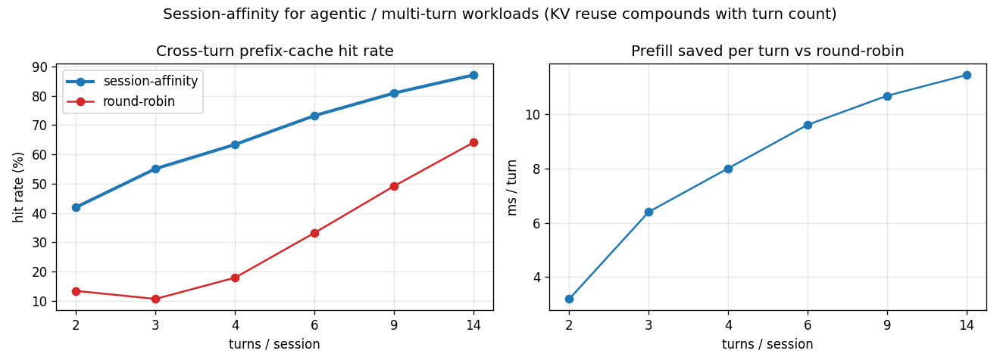

# Agentic Benchmark: session-affinity vs round-robin on multi-turn loops

Workload: 24 parallel agent sessions, each running T turns; every turn extends the session's prompt by 8 blocks (tool call + result) on top of a 2-block shared system prefix. Hit rate is measured against independent per-backend KV models (the backend's own truth). Fleet: 3 backends.

| turns / session | session-affinity hit% | round-robin hit% | prefill saved per turn |
|---|---|---|---|
| 2 | 42.0% | 13.4% | 3.2 ms |
| 3 | 55.1% | 10.6% | 6.4 ms |
| 4 | 63.4% | 17.9% | 8.0 ms |
| 6 | 73.2% | 33.2% | 9.6 ms |
| 9 | 80.9% | 49.1% | 10.7 ms |
| 14 | 87.1% | 64.0% | 11.4 ms |

**Headline at 14 turns**: session-affinity keeps **87%** of blocks cached (each turn only prefills its small delta on top of the previous turn's warm KV); round-robin scatters each turn across backends, dragging hit rate to **64%** -- every turn re-prefills the full growing context on whichever node the LB happened to pick. The win COMPOUNDS with turn count -- the natural shape of an agent loop.

## Caveat

Algorithm-level. Hit rate is the backend KV model's own truth, not the gateway's belief; no network/GPU. It measures the cross-turn KV reuse session-affinity unlocks, which is exactly what frontier 'agentic inference' workloads (the SGLang/DeepLearning.AI slide) call out as the hard part: 'KV cache management across turns'. Same GPU-independent framing as the other benches.
