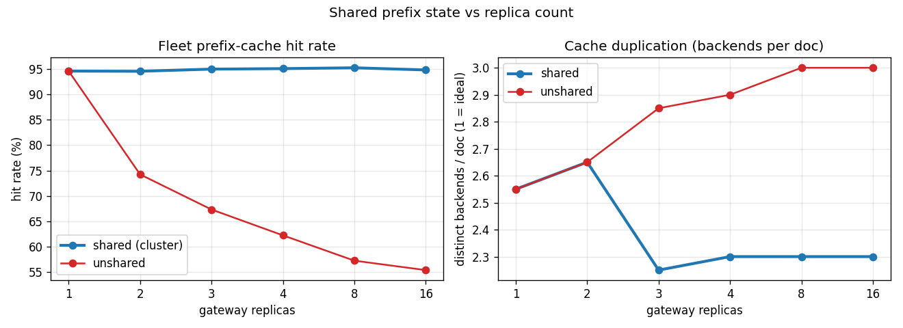

# Cluster-Scaling Benchmark: shared vs unshared prefix state

Fleet: 3 backends x 600 blocks. Workload: 20 docs x 96 blocks, Zipf alpha=1.0, round-robin load balancer across N replicas.

Each replica keeps its own radix tree. **unshared** = replicas route from only their own history; **shared** = the cluster bus converges all trees (what `GW_CLUSTER_ENABLED` does). Hit rate is measured against independent per-backend KV models. **dup** = avg distinct backends a doc lands on; it's >1 even when shared because the router intentionally replicates *hot* docs across backends for load balance -- so read the unshared-minus-shared gap as the *uncoordinated* fragmentation that shared state removes, not dup itself.

| replicas | unshared hit% | shared hit% | unshared dup | shared dup |
|---|---|---|---|---|
| 1 | 94.6% | 94.6% | 2.55 | 2.55 |
| 2 | 74.2% | 94.6% | 2.65 | 2.65 |
| 3 | 67.3% | 95.0% | 2.85 | 2.25 |
| 4 | 62.2% | 95.1% | 2.90 | 2.30 |
| 8 | 57.2% | 95.3% | 3.00 | 2.30 |
| 16 | 55.4% | 94.8% | 3.00 | 2.30 |

**Headline**: shared prefix state holds **~95%** hit rate at every replica count, while unshared collapses from 95% (1 replica) to **55%** at 16 replicas -- each replica only learns ~1/N of the prefix map, so most requests land on a replica that's never seen the doc and routes blind. At 1 replica the two are identical (nothing to share); the widening gap is exactly the value of replicated prefix state (dup also rises 2.3→3.0 from uncoordinated fragmentation).

## Caveat

Algorithm-level: hit rate is the backend KV model's own truth, not the gateway's belief; no network/GPU. It measures how routing quality scales with replica count, not absolute latency. Same caveat as `bench/matrix.py`.
