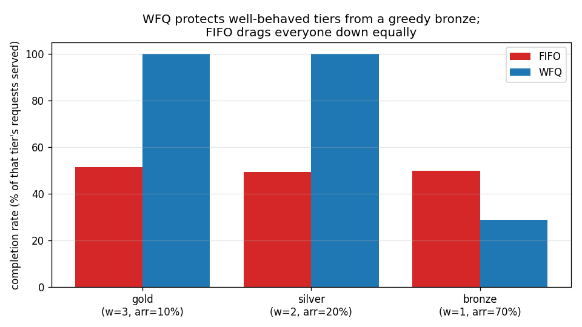

# Weighted-Fair-Queuing Benchmark: WFQ vs FIFO under a greedy tenant

Tiers gold:silver:bronze = weights 3:2:1. A **greedy bronze** sends 70% of arrivals; gold only 10%. Capacity serves 50% of arrivals. Metric: **completion rate** = served ÷ that tier's own arrivals.

| tier | weight | arrivals | FIFO completion | WFQ completion |
|---|---|---|---|---|
| gold | 3 | 601 | 51% | 100% |
| silver | 2 | 1178 | 49% | 100% |
| bronze | 1 | 4221 | 50% | 29% |

**FIFO punishes everyone for bronze's flood** — gold, a paying tier sending only 10% of traffic, is dragged down to ~51% completion by the noisy neighbour. **WFQ protects the well-behaved tiers**: gold + silver stay near **100%/100%** completion and the greedy bronze absorbs the shortfall (~29%) — isolation by tier weight, independent of how much bronze floods.

## Caveat

Pure scheduling simulation of `gateway/fairqueue.WeightedFairQueue` (Start-time Fair Queuing). It proves the fairness/isolation property; wiring it as an async admission queue under a live concurrency limit is the integration step. Same GPU-independent framing as the other benches.
