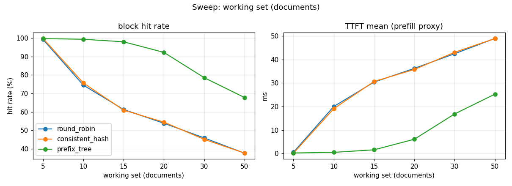
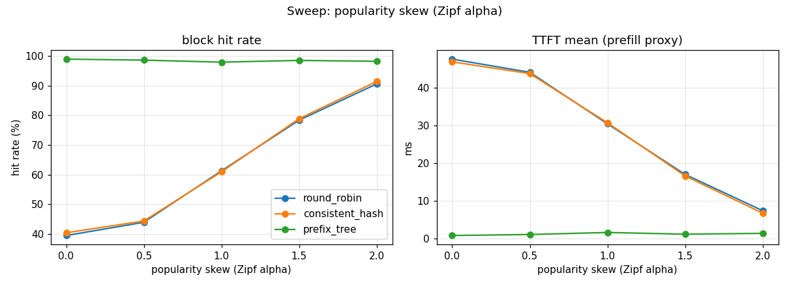
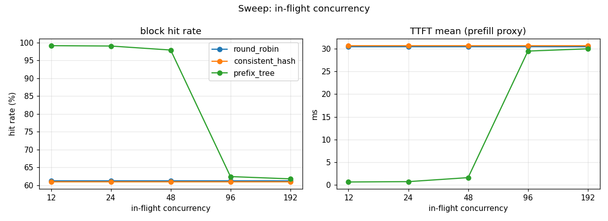
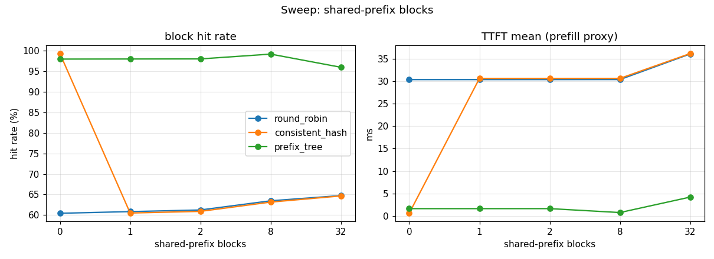

# Routing benchmark matrix

Fleet: 3 backends x 600 blocks. Baseline workload: 15 docs, 96 blocks/doc, 2 shared-prefix blocks, Zipf alpha=1.0, concurrency=48.

## What these numbers are (and are not)

The **block hit rate** is measured against an independent per-backend KV cache model, so it is the backend's own truth, not the gateway's belief. The **TTFT** column is a *prefill proxy* (0.05 ms/token x uncached tokens): it isolates the compute a cache hit removes. The proxy is bimodal per request (~0 on a hit, the full document prefill on a cold miss), so the **mean** is the metric that tracks routing quality; the **p99** is the same cold-miss cost for every strategy -- prefix routing does not make a cold miss cheaper, it makes one *rarer*. These quantities are GPU-independent -- they measure *routing quality*. Absolute wall-clock latency, tokenizer fidelity and KV-memory limits require the vLLM GPU validation run and are out of scope here. **cov** is the coefficient of variation of the request distribution (0 = perfectly balanced).

## Baseline

| strategy | block hit rate | TTFT mean (ms) | TTFT p99 (ms) | load cov |
|---|---|---|---|---|
| round_robin | 61.3% | 30.4 | 76.8 | 0.00 |
| consistent_hash | 60.9% | 30.6 | 76.8 | 1.41 |
| prefix_tree | 97.9% | 1.6 | 76.8 | 0.07 |

## Sweep: working set (documents)

| working set (documents) | round_robin hit% | consistent_hash hit% | prefix_tree hit% |
|---|---|---|---|
| 5 | 99.3 | 99.8 | 99.7 |
| 10 | 74.5 | 75.7 | 99.3 |
| 15 | 61.3 | 60.9 | 97.9 |
| 20 | 53.8 | 54.4 | 92.2 |
| 30 | 45.9 | 45.1 | 78.5 |
| 50 | 37.6 | 37.6 | 67.8 |

## Sweep: popularity skew (Zipf alpha)

| popularity skew (Zipf alpha) | round_robin hit% | consistent_hash hit% | prefix_tree hit% |
|---|---|---|---|
| 0.0 | 39.4 | 40.3 | 99.0 |
| 0.5 | 43.9 | 44.3 | 98.6 |
| 1.0 | 61.3 | 60.9 | 97.9 |
| 1.5 | 78.3 | 78.8 | 98.5 |
| 2.0 | 90.6 | 91.4 | 98.2 |

## Sweep: in-flight concurrency

| in-flight concurrency | round_robin hit% | consistent_hash hit% | prefix_tree hit% |
|---|---|---|---|
| 12 | 61.3 | 60.9 | 99.2 |
| 24 | 61.3 | 60.9 | 99.1 |
| 48 | 61.3 | 60.9 | 97.9 |
| 96 | 61.3 | 60.9 | 62.4 |
| 192 | 61.3 | 60.9 | 61.8 |

## Sweep: shared-prefix blocks

| shared-prefix blocks | round_robin hit% | consistent_hash hit% | prefix_tree hit% |
|---|---|---|---|
| 0 | 60.5 | 99.2 | 97.9 |
| 1 | 60.9 | 60.5 | 97.9 |
| 2 | 61.3 | 60.9 | 97.9 |
| 8 | 63.5 | 63.2 | 99.1 |
| 32 | 64.8 | 64.7 | 95.9 |
